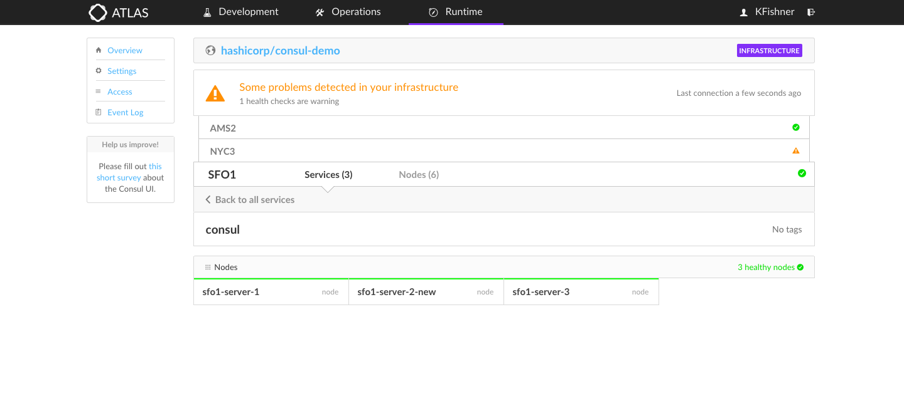

# 1.4.7 Web UI

Consul 内置了美观好用的 UI，可以用来查看服务和节点、健康检测和状态、读写 k/v 数据。而且支持多数据中心。

有两种方式查看 UI，一种是使用 [Atlas by HashiCorp](https://atlas.hashicorp.com/) 做 host，第二种是使用自己的主机。

## Atlas-hosted Dashboard


为了使用 Atlas UI，你需要在配置文件中配置你的 Atlas 用户名和 token。下面是一个通过命令行设置的例子。
```bash
$ consul agent -atlas=ATLAS_USERNAME/demo -atlas-token="ATLAS_TOKEN"
```

关于 Atlas 的用户名和 token，需要创建一个 [Atlas 账户](https://atlas.hashicorp.com/account/new?utm_source=oss&utm_medium=getting-started-ui&utm_campaign=consul)，然后替换掉配置中对应的值。

## Self-hosted Dashboard


本地使用 UI 比较简单。
```bash
$ consul agent -ui
```

然后通过 `http://localhost:8500/ui` 就可以访问了。

[UI demo](http://demo.consul.io/) 在此。

## 下一步
上面就是我们的新手指南的全部内容了，只是带大家熟悉一下 Consul。查看 [下一步](next_steps.md) 查看关于 Consul 的更多内容。